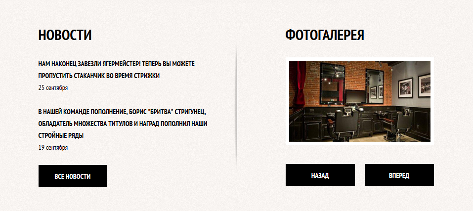
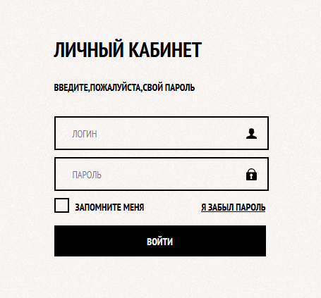

# Верстка

### Материалы для изучения:

- [Знакомство с HTML и CSS](https://htmlacademy.ru/courses/297)
- [Структура HTML-документа](https://htmlacademy.ru/courses/299)
- [Разметка текста](https://htmlacademy.ru/courses/301)
- [Ссылки и изображения](https://htmlacademy.ru/courses/305)
- [Основы CSS](https://htmlacademy.ru/courses/307)
- [Оформление текста](https://htmlacademy.ru/courses/309)
- [Flex](https://tpverstak.ru/flex-cheatsheet/)
- [Старт в Figma для верстальщика](https://htmlacademy.ru/blog/boost/tools/figma?utm_source=google&utm_medium=cpc&utm_campaign=rf_dsa_9730782229&keyword=&gclid=CjwKCAjwlYCHBhAQEiwA4K21m2ZkDapWrIW_6TxoDoqZNdIKqfOXhY0F2rYbjMsmxwdGD0TpliPZuRoCFLUQAvD_BwE)

### Задачи:

- верстка блока меню

- верстка блока новостей и галереи

- верстка блока формы

- [Макет для верстки](https://www.figma.com/file/fn7TA4MCrTj7Ad2dAPja7Q/Freebie-Agency?node-id=0%3A1)

  